# ComProtein
In the field of biochemistry, protein design engineering is of utmost importance. Deep learning is anticipated to enable breakthroughs in diverse applications, including synthetic biology, healthcare, and material science. Nevertheless, existing methods predominantly focus on generating new protein sequences from the same biological domain as the training data, thus remaining constrained. In this paper, we present ComProtein, a novel approach that exploits the potential of pre-trained protein large language models, which aims to generate innovative sequences that reflect combinative biological features from two different domains. This process is orchestrated via cycle-consistent generative adversarial and a perspective from the latent space. Additionally, we introduce new evaluative metrics to complement the existing measures. Our experimental results demonstrate that our proposed method performs better and has great potential in biological representations, structure similarity, homology relationships, and sequence quality.

It's our great hornor to get you attention to our work ComProtein. Due to the optimization and reconstruction of our project with submission time constrain, we have shown a initial demo, and the complete refined version and  more details will be added soon.

# Closely Related Generation
|  |  |  |  |
|---|---|---|---|
| 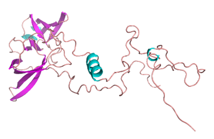   | 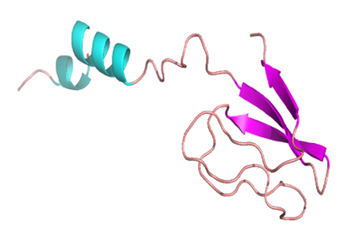 | 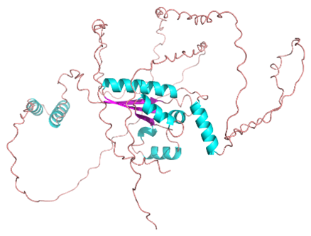   | 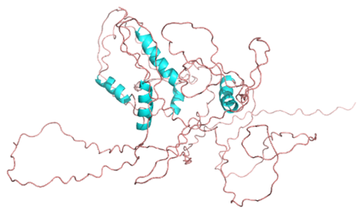 |
| (a) Domain A - A   | (b) Domain A - B | (c) Domain B - A   | (d) Domain B - B |
| 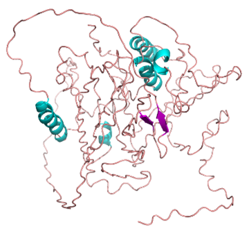  | 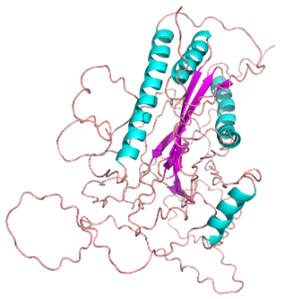  | 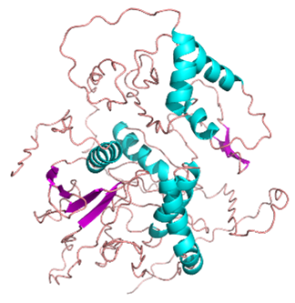 | 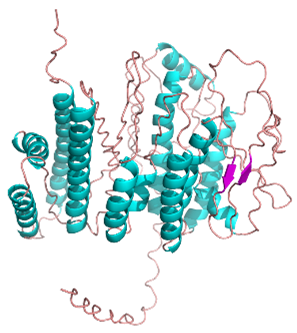 |
| (a) Generated - A   | (b) Generated - B | (c) Generated - C   | (d) Generated - D |

# Distantly Related Generation
|  |  |  |  |
|---|---|---|---|
| 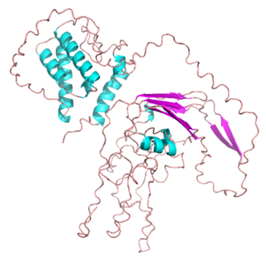   | 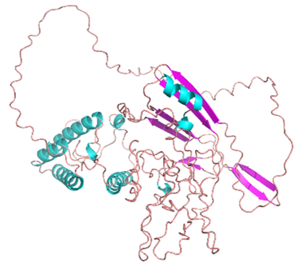 | 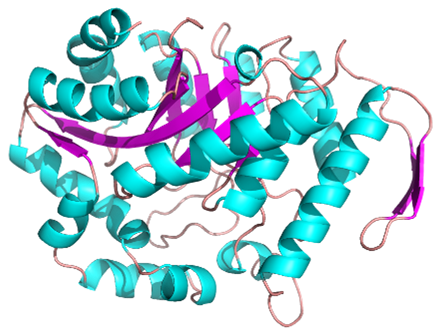   |  |
| (a) Domain A - A   | (b) Domain A - B | (c) Domain B - A   | (d) Domain B - B |
| 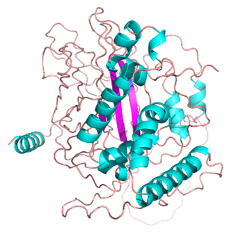  | 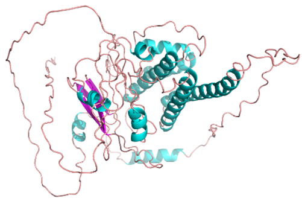  | 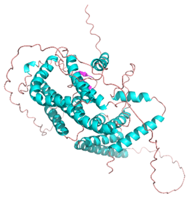 | 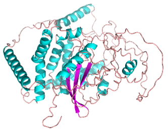 |
| (a) Generated - A   | (b) Generated - B | (c) Generated - C   | (d) Generated - D |
